# Modularizing SwiftUI Projects
## Get separate!

In this particular tutorial I want to cover modularization. Specifically I want to cover having a UIComponent library and how this might actually be used in practice to sample what your components might be and integrate them into your project.

Difficulty: Beginner | Easy | **Normal** | Challenging<br/>
This article has been developed using Xcode 12.4, and Swift 5.7.2

## Prerequisites:
You need to be able to code in Swift, perhaps using
[Playgrounds](https://medium.com/@stevenpcurtis.sc/coding-in-swift-playgrounds-1a5563efa089) and be able to use SwiftUI

# Don't bore us, get to it!
## Create a new project

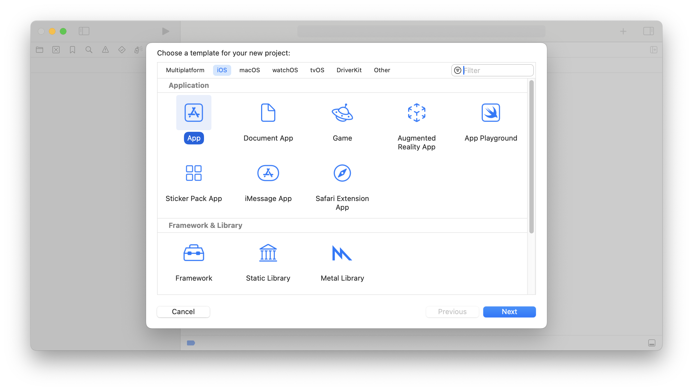

Name the main module

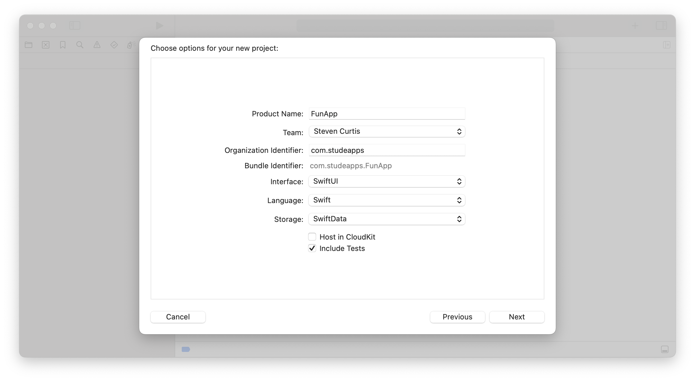

This is the entry point to the App and will contain the other modules. Typically this would contain things like modules responsible for networking and shared components (etc.).

## Create A Shared Components Framework

I'm going to create a new project for my components. The idea here is that I can create some buttons and views that can be used anywhere within my fun App!
This time rather than creating a new project I'll create a new framework.

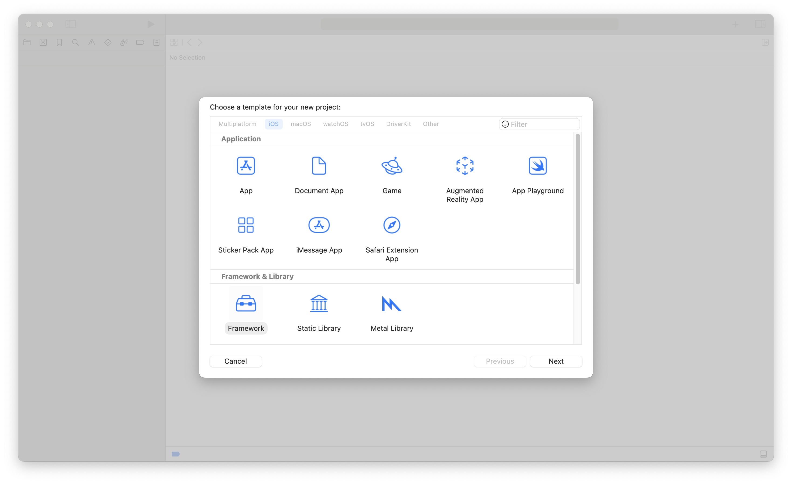

I then call fill out the following fields for the component library:

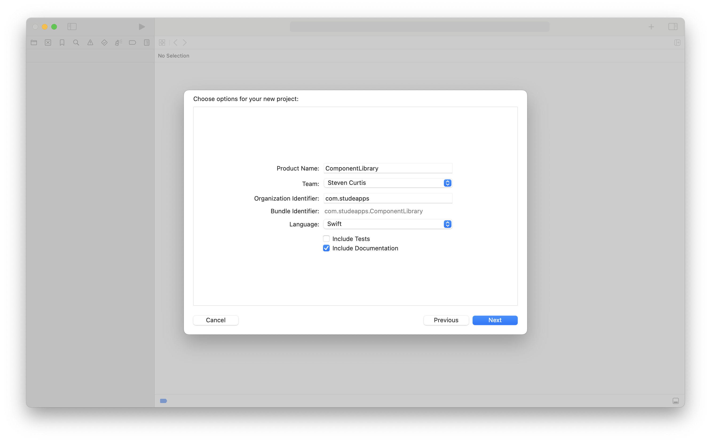

I don't need tests for this one as it's goig to be UI only (discuss this choice in the comments).
I'm going to setup a simple button in the framework. Here is the code for my button. Note that the initializer needs to be public so it is accessible from outside it's containing module.

```swift
import SwiftUI

public struct SimpleButtonView: View {
    public var action: () -> Void
    public var buttonText: String
    
    public init(action: @escaping () -> Void, buttonText: String) {
        self.action = action
        self.buttonText = buttonText
    }

    public var body: some View {
        Button(action: action) {
            Text(buttonText)
                .padding()
                .background(Color.blue)
                .foregroundColor(.white)
                .cornerRadius(10)
        }
    }
}
```

So I'll create a new file.

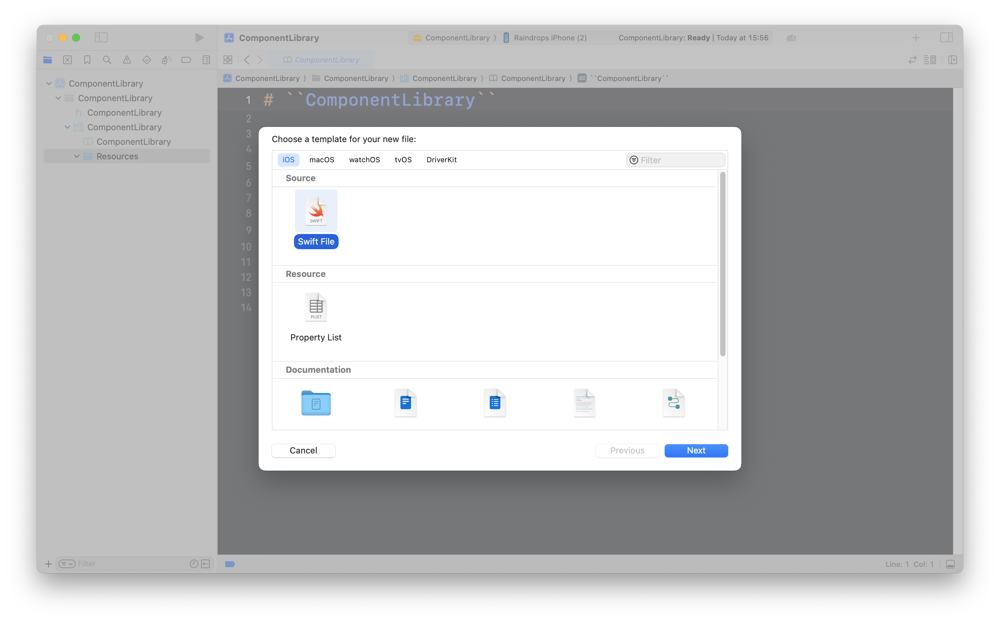

I'll call it `SimpleButtonView` and place it into the root of the `ComponentLibrary`. I can copy pasta my code into the file. That's nice.

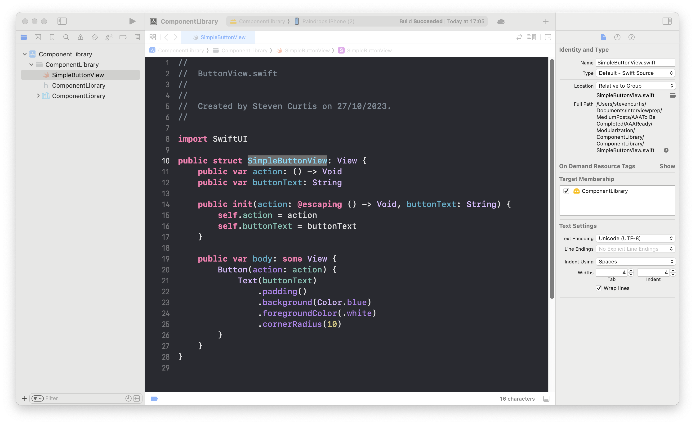

The project builds but I can't see anything. That's not ideal. Let's fix this. I want to combine these two modules into one workspace. How hard can it be?

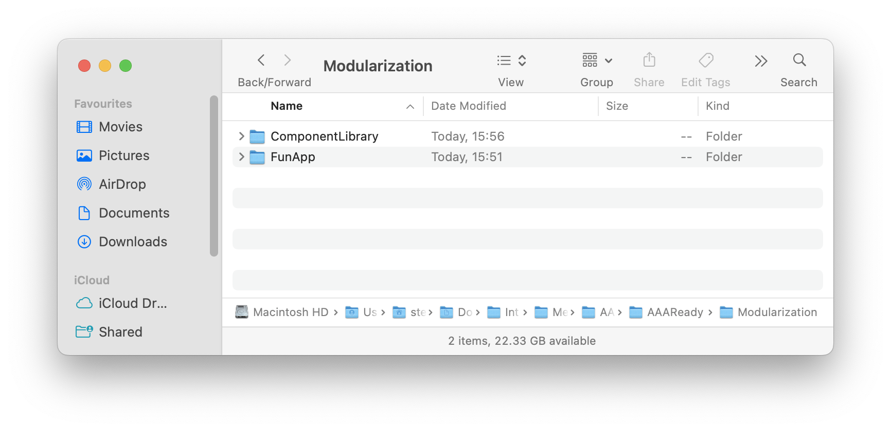

In Xcode we can File>New>Workspace…

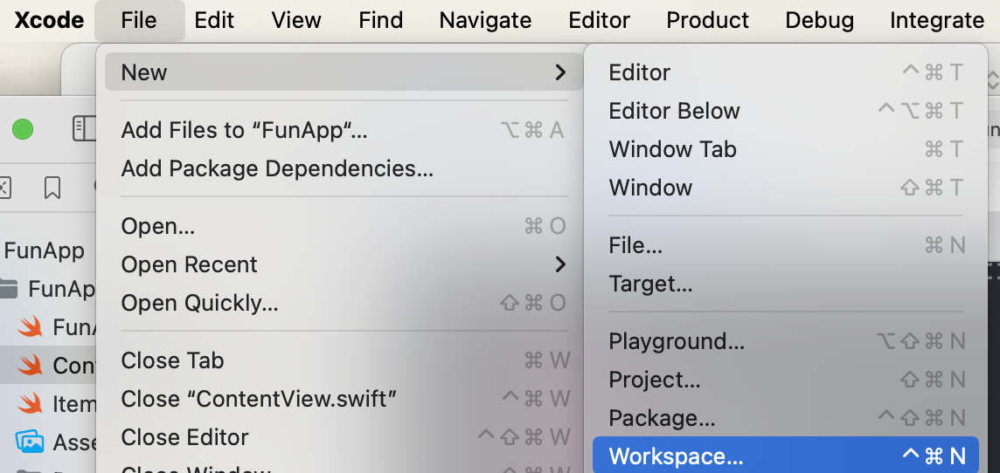

I’m calling my workspace `FunApp` which I will put alongside the framework and project folders

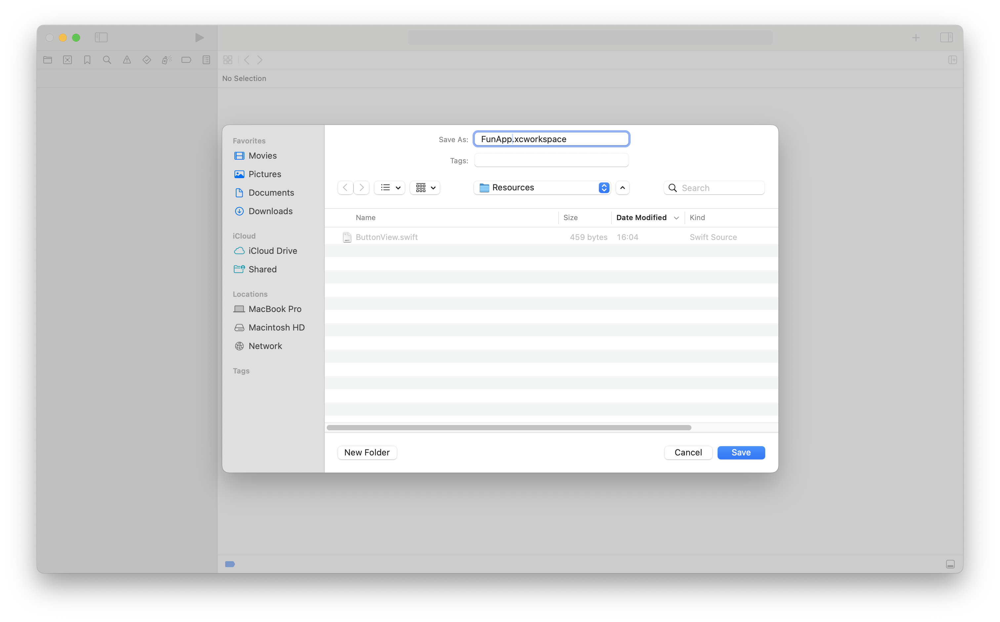

It's a bit upsetting because nothing is going on in this workspace. To solve this I'm going to drag my funapp and component library in there so there is something to work with.
I set this up by dragging in the `xcodeproj` files in.

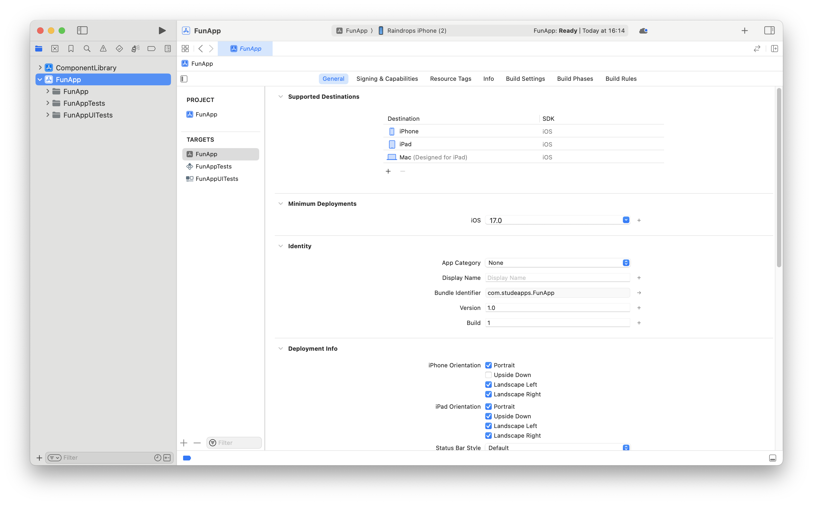

Now the order of the modules matters. The one at the top is built first so it makes sense to put ComponentLibary there as the FunApp is dependent on it.

FunApp needs to be able to import the component library framework. I can choose the target FunApp and then add the framework as a dependency.

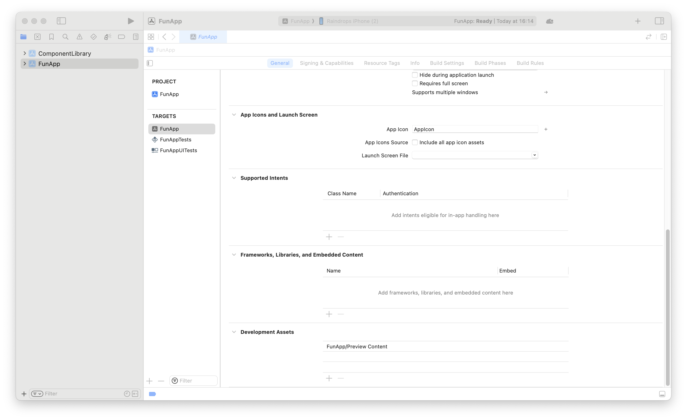

Under Frameworks, Libraries, and Embedded Content I select the reassuring + button. I can then add the component library:

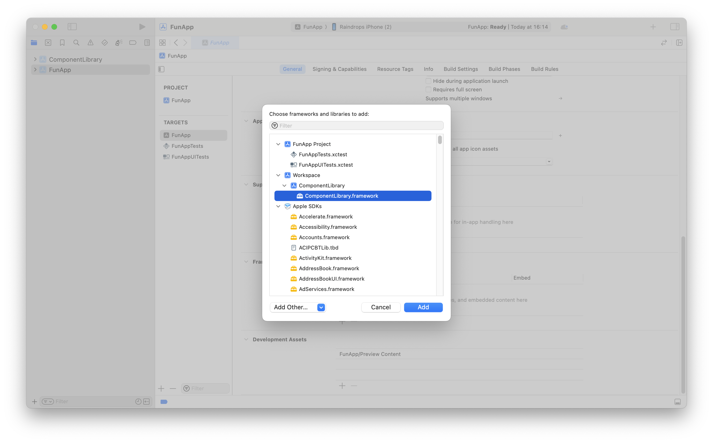

I can then reference this new button from inside my main code. That would be really a great thing to do.

```swift
import ComponentLibrary
import SwiftUI
import SwiftData

struct ContentView: View {
    var body: some View {
        Group {
            Text("Hello, World!")
            SimpleButtonView(action: {
                print("Press button")
            }, buttonText: "My Text")
        }
    }
}

#Preview {
    ContentView()
}
```

Which will give the following


# I'm not satisfied.
What would the workflow of this be like? You develop the shared component right in the framework? I don't think so as you wouldn't get any information about what that component looks like until you integrated it into the main app. The alternative is to create the component in the main app and then drag it into the framework. Not brilliant.

You know what we need? Another project.

UIProject is going to be a project for me to test all of my UI components that can then be used in the main project. Don't worry, I'm not going to take you through creating the whole project again. Also inevitably I'm going to need to create another workspace with the main project and the components in it. No worries!

I'm telling you this partly because it's a good way of creating a component library and partly to make it clear that having multiple workspaces sharing the same framework is a cool thing to do. Think about it!

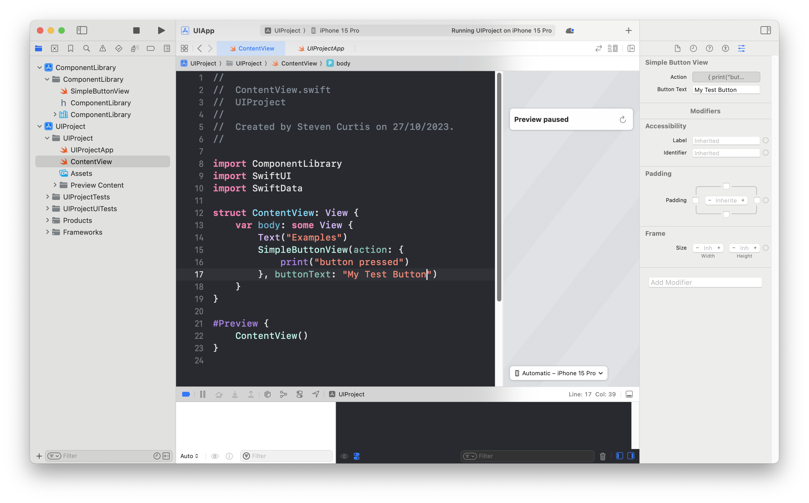<br>

<br>
# Conclusion
If you've got any comments I'd love to hear them. Anyway this is how I might implement a component library and I hope you enjoyed reading this.

I hope this article has helped someone out, and perhaps I'll see you at the next article?
