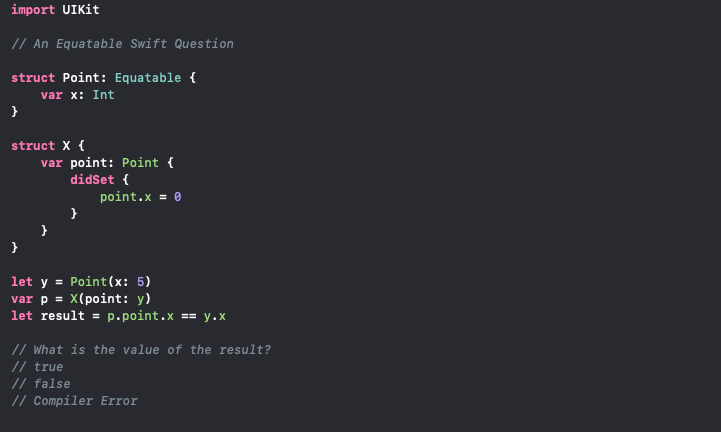

# Can You Answer This Swift Question Correctly?
## Only half of Swift developers can get this right

<br>


Difficulty: Beginner | Easy | Normal | Challenging

---

# Prerequisites:
Be able to produce a "Hello, World!" iOS application ([guide HERE](https://medium.com/@stevenpcurtis.sc/your-first-swift-application-without-a-mac-79598ad839f8))

---

# Terminology
Equatable: A protocol that can be applied to a type to allow value equality.
initializer: methods used to create an instance of a particular type.
Property Observers: Change and respond to changes in a property value. In Swift this is through didSet and willSet.
didSet: A property observer called immediately after a new value is stored.
willSet: A property observer called just before a value is stored.

---

There are a number of Swift Twitter quiz questions floating around on Twitter. One such question seems to have tripped up 50% of Swift developers:

```swift
// An Equatable Swift Question

struct Point: Equatable {
    var x: Int
}

struct X {
    var point: Point {
        didSet {
            point.x = 0
        }
    }
}

let y = Point(x: 5)
var p = X(point: y)
let result = p.point.x = y.x

// What is the value of the result?
// true
// false
// Compiler Error
```

Now we should take some time to decide whether we know the answer...

The answer is *true*

Now let us investigate why this happens to be true.

---

didSet (and of course willSet) is not called on an initializer, meaning that that pesky = 0 operation is never called. In this case, it means that the resulting calculation is actually 5. 
Awesome?
You must have anticipated that there would be some kind of trick here. Well, if you did you wouldn't be disappointed in this case!

---

Conclusion
I've had this article knocking around for some time. I've used this for myself as a reminder that didSet isn't called by initializers and I hope this article has helped you out too.
Here is the original tweet for the Swift question that has been posted on Twitter.
Subscribing to Medium using this link shares some revenue with me. Or click the rather large banner below! Any revenue encourages me to create more articles. I know I have a large amount of articles, but some of these earn less than $1 dollar and without some support I find it difficult to justify time away from my family to create these tutorials (so any help is much appreciated).
Join Medium with my referral link - Steven Curtis
Read every story from Steven Curtis (and thousands of other writers on Medium). Your membership fee directly supports…stevenpcurtis.medium.com
You might alternatively like to give me a hand by buying me a coffee https://www.buymeacoffee.com/stevenpcuri.
If you've any questions, comments or suggestions please hit me up on Twitter
